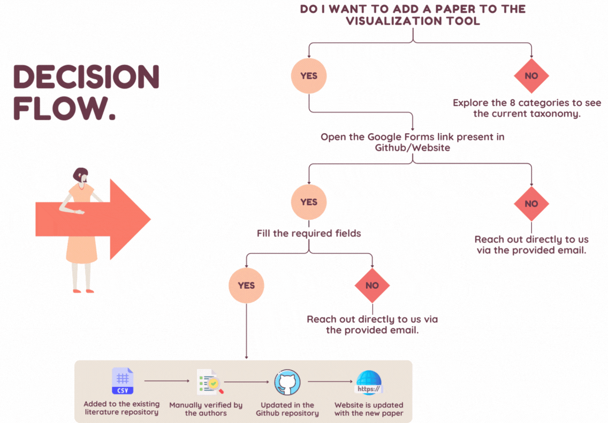

# Visualization Tool for LLM-based Planning Literature

## Overview
The field of Large Language Models (LLMs) and Planning has expanded rapidly, with an 850% increase in research papers from 2022 to 2023, and continues to grow in 2024. This visualization tool was developed to centralize and categorize the exponentially growing literature on this topic. Originating from our paper presented at ICAPS 2024, *"[On the Prospects of Incorporating Large Language Models (LLMs) in Automated Planning and Scheduling (APS)](https://arxiv.org/abs/2401.02500)"*, our repository aims to update and refine the categorization of relevant research continually with the help of crowd-sourcing.

## Categories of LLM Use in Planning
Our work identifies eight distinct categories where LLMs are applied in the field of planning:

| Category               | Description                                                                                           |
|------------------------|-------------------------------------------------------------------------------------------------------|
| :globe_with_meridians: **Language Translation**                    | Involves converting natural language into structured planning languages or formats like PDDL, enhancing the interface between human linguistic input and machine-understandable planning directives.           |
| :straight_ruler: **Plan Generation**                      | Entails the creation of plans or strategies directly by LLMs, focusing on generating actionable sequences or decision-making processes.                                                    |
| :building_construction: **Model Construction**                 | Utilizes LLMs to construct or refine world and domain models essential for accurate and effective planning.                                    |
| :people_holding_hands: **Multi-agent Planning**                     | Focuses on scenarios involving multiple agents, where LLMs contribute to coordination and cooperative strategy development.                                             |
| :repeat: **Interactive Planning**                             | Centers on scenarios requiring iterative feedback or interactive planning with users, external verifiers, or the environment, emphasizing the adaptability of LLMs to dynamic inputs.                               |
| :chart_with_upwards_trend: **Heuristics Optimization**               | Applies LLMs in optimizing planning processes through refining existing plans or providing heuristic assistance to symbolic planners.                                                |
| :hammer_and_wrench: **Tool Integration**                             | Encompasses studies where LLMs act as central orchestrators or coordinators in a tool ecosystem, interfacing with planners, theorem provers, and other systems.                                 |
| :brain: **Brain-Inspired Planning**                                | Covers research focusing on LLM architectures inspired by neurological or cognitive processes, particularly to enhance planning capabilities.         |

## How to Contribute
We welcome contributions to expand and refine our categorization. To add papers to the visualization, please fill out this form: [Google Forms Link](https://forms.gle/gEfNaetfyVQFpMFfA)

Below is a flowchart that outlines the process from submitting your contribution via the Google Form to seeing it displayed on the website:



## Support and Contact
For any queries or feedback, feel free to reach out to vishalp@mailbox.sc.edu.

## Collaborators
- [Vishal Pallagani](https://www.linkedin.com/in/vishalpallagani/)
- [Bharath Muppasani](https://www.linkedin.com/in/bharath-9798/)
- [Kaushik Roy](https://www.linkedin.com/in/kaushik-roy-b8a323ab/)
- [Francesco Fabiano](https://www.linkedin.com/in/francesco-fabiano-97819a166/)
- [Andrea Loreggia](https://www.linkedin.com/in/andrea-loreggia/)
- [Keerthiram Murugesan](https://www.linkedin.com/in/keerthiram)
- [Biplav Srivastava](https://www.linkedin.com/in/biplav-srivastava)
- [Francesca Rossi](https://www.linkedin.com/in/francesca-rossi-34b8b95)
- [Lior Horesh](https://www.linkedin.com/in/lior-horesh-7365a46)
- [Amit Sheth](https://www.linkedin.com/in/amitsheth/)

## Citation for the Tool

If you use the visualization tool in your work, please cite it as follows:

```
@inproceedings{pallagani2024prospects,
  title={On the prospects of incorporating large language models (llms) in automated planning and scheduling (aps)},
  author={Pallagani, Vishal and Roy, Kaushik and Muppasani, Bharath and Fabiano, Francesco and Loreggia, Andrea and Murugesan, Keerthiram and Srivastava, Biplav and Rossi, Francesca and Horesh, Lior and Sheth, Amit},
  booktitle={34th International Conference on Automated Planning and Scheduling},
  year={2024}
}
```

---

We look forward to your contributions and hope this tool aids researchers and practitioners alike in navigating the expanding landscape of LLMs in planning.
